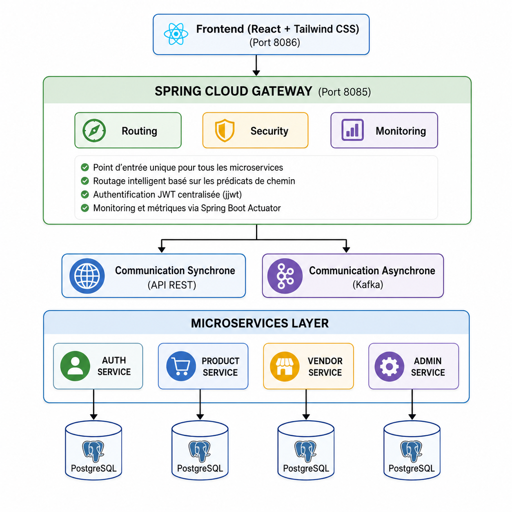

<h1 align="center">SoukScan: DevSecOps & Microservices E-Commerce Platform</h1>

  
  
  
  
  

---

## 📌 Project Overview

**SoukScan** is a comprehensive, microservices-based application designed to dynamically monitor product prices and vendor locations across Moroccan markets. 

> 🔒 **Note on Source Code:** The core application source code is maintained in a private team repository. This showcase repository highlights the system architecture, the DevSecOps deployment pipelines, and the project management methodology implemented throughout the development lifecycle.

**📄 Full Documentation:** [Download the Technical Report (PDF)](./Rapport_Soukscan.pdf)

---

## 👔 Project Management & My Role

This project was developed by an engineering team using the **Agile/Scrum methodology** through iterative sprints.

**My Role: Product Owner & Technical Contributor**
* Defined the product vision, created user stories, and managed the Product Backlog to ensure the platform met business and security requirements.
* Prioritized sprint tasks and facilitated communication between frontend and backend developers to ensure seamless API integration.
* Contributed technically to the architectural design and DevSecOps pipeline implementation.

---

## 🏗️ System Architecture 

The platform is engineered using a decoupled microservices architecture to ensure scalability, fault tolerance, and secure data flow.

* **Frontend Layer (Port 8086):** Built with React (TypeScript) and Tailwind CSS for a highly responsive user experience.
* **Spring Cloud Gateway (Port 8085):** Acts as the single entry point for all microservices, providing:
  * Intelligent route mapping.
  * Centralized JWT-based Authentication.
  * System monitoring and metrics via Spring Boot Actuator.
* **Inter-Service Communication:** Utilizes **REST APIs** for synchronous requests and **Apache Kafka** for asynchronous event streaming.
* **Microservices Layer:** Split into dedicated business domains:
  * `Auth Service`
  * `Product Service`
  * `Vendor Service`
  * `Admin Service`
* **Data Sovereignty:** Adheres to the "database-per-service" pattern, with each microservice maintaining its own isolated **PostgreSQL** database.

---

## 🛡️ DevSecOps & Pipeline Integration

A major focus of this project was shifting security left by embedding DevSecOps practices directly into the development and deployment pipelines.

### 1. Continuous Integration / Continuous Deployment (CI/CD)
* Automated build and testing stages utilizing GitHub Actions.
* Version control integration to ensure all commits pass baseline unit tests before merging.

### 2. Containerization & Orchestration
* Created optimized `Dockerfiles` for each microservice to ensure lightweight and secure image builds.
* Utilized `docker-compose` and Kubernetes (k3s) for orchestration, network isolation, and secure environment variable management.

### 3. Security Integration
* Enforced secure coding practices and dependency scanning (OWASP Dependency-Check, Trivy, Semgrep) to identify vulnerable libraries early in the build process.
* Implemented DAST (Dynamic Application Security Testing) using OWASP ZAP.

---

## 🚀 Repository Contents

To demonstrate the architectural and DevOps implementation, this repository includes:
* 📄 `Rapport_Soukscan.pdf`: Comprehensive documentation of the project lifecycle, UML diagrams, and technical decisions.
* 🖼️ `image_f3097c.jpg`: High-level system architecture diagram.
* 📂 `devops_configs/`: Sanitized examples of the infrastructure-as-code and pipeline configurations, including CI/CD workflow templates and Docker configurations.
